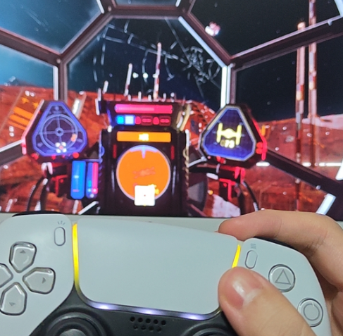

# Experience Your DualSense Controller in ANY Video Game

Give PC games that never supported the PS5 controller **adaptive triggers and a live lightbar**, driven by
what actually happens in the game: one trigger kick per shot fired, a lightbar that follows your health.
Game state is read from (and lightly hooked into) the running game's memory; effects are sent to
[DSX](https://store.steampowered.com/app/1812620/DSX/), which owns the controller.

**Everything here is for offline play only.** Hooking a game while it is online, or while its
anti-cheat runs, is never supported: the memory layer refuses to attach while an anti-cheat is running.

## Games that have been applied with the skill

| Game | Build | Branch | Trigger (RT) | Lightbar | Scripts |
|---|---|---|---|---|---|
| Star Wars: Squadrons | EA app 1.0.10.39591 | `online` (has EAC, offline modes only) | one pulse per shot fired, any ship and weapon | follows hull: green → yellow → red, red flash on hits, pulses below 25 % | [games/star_wars_squadrons](../../tree/online/games/star_wars_squadrons) |



*Star Wars: Squadrons, in a TIE fighter cockpit: the lightbar has turned yellow because the hull is
damaged. It goes back to green as the hull repairs and turns red, then pulses, when the hull is low.*

## Two branches

| | [`single-player`](../../tree/single-player) | [`online`](../../tree/online) |
|---|---|---|
| Games | single-player games **without** anti-cheat | games **with** online modes and an anti-cheat (EAC, ...) |
| How | hook the game, play | play **only its offline modes, with the anti-cheat switched off**, then restore it before going online |
| Rules | offline use, otherwise free | strict: [ANTI_CHEAT_RULES.md on the online branch](../../blob/online/ANTI_CHEAT_RULES.md) |
| Games so far | none yet | Star Wars: Squadrons |

`main` holds everything the two branches share. Core fixes land here first and are merged into both.

## Shared core

```
dualsense/
  dsx.py          DSX UDP protocol: trigger modes, lightbar RGB, reset
  effects.py      GameState -> RT effect (one pulse per shot, adaptive length) and lightbar colour (health)
  player.py       XInput trigger read + PlayerPicker (the player's object = the one acting while you press RT)
  bridge.py       loop (read -> effects -> DSX), demo reader, CLI
  profile.py      builds a DSX controller profile from a game's dsx_profile.toml
  memory.py       process memory: attach, read, AOB scan, write / allocate; refuses while anti-cheat runs
  hook.py         register spy: patch an instruction to record the object it works on
  reader.py       HookReader: game state from a few hooks (a game only declares which hook is which)
  hooktools.py    --scan / --probe options
games/_template/  start here for a new game (copy it on the right branch)
tools/re/         reverse-engineering helpers (find writers, count calls, find callers, audio pan)
tools/haptics/    tests for the haptics output paths
skill/            Claude Code skill: the whole workflow
tests/            python -m unittest discover tests
```

Requirements: Windows 10/11, Python 3.11+ (stdlib only for playing), DSX v3 with
*Settings → Networking → Incoming UDP* on and virtual device **Xbox 360**.

## Claude Code skill

[`skill/dualsense-for-every-game`](skill/dualsense-for-every-game/SKILL.md): copy the folder to
`~/.claude/skills/` and run `/dualsense-for-every-game`.

## Prior art and credits

This project stands on others' work; every borrowed idea is listed, with what was taken, in
[`skill/.../references/prior-art.md`](skill/dualsense-for-every-game/references/prior-art.md). In short:

- [universal-modder](https://github.com/rehan-remade/universal-modder): route ladder, MODLOG / field
  notes, backups first, "the running game is the oracle", 3-strike circuit breaker, vertical slice.
  Its anti-cheat guardrail is stricter than this repo's `online` branch; prior-art.md says how.
- [awesome-game-security, reverse-engineering skill](https://github.com/gmh5225/awesome-game-security/blob/main/.claude/skills/reverse-engineering/SKILL.md):
  record build hashes; separate runtime evidence from static inference.
- DSX mods: [ForzaDSX](https://github.com/cosmii02/ForzaDSXlegacy) (telemetry),
  [RDR2 – DSX](https://github.com/Shtivi/RDR2-DualSense) and
  [Cyberpunk Enhanced DualSense Support](https://www.nexusmods.com/cyberpunk2077/mods/4156) (script hooks,
  per-weapon triggers, real attack speed), [RE4 Remake triggers](https://www.nexusmods.com/residentevil42023/mods/5813)
  (REFramework), and [DSX](https://github.com/Paliverse/DualSenseX) itself.
- Star Wars: Squadrons: FearLess Cheat Engine table (first signatures), PCGamingWiki (offline EAC method).

## License

MIT
